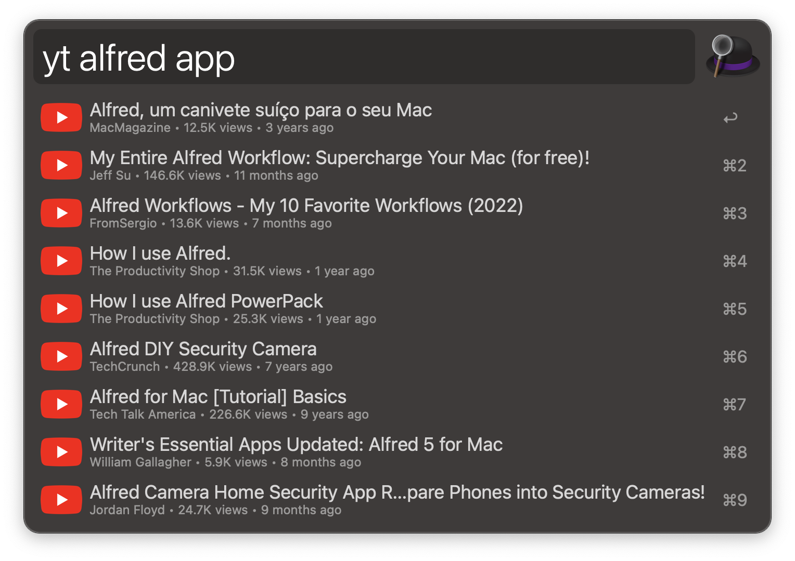

<h1 align="center">YouTube Search</h1>

  
  
  

  

Search YouTube from [Alfred][1].

## Setup

The workflow requires an API key, which can be requested and set up by following
the steps 1-3 that you can find [here][2].

## Usage

Search YouTube videos via the `yt` keyword and YouTube channels via the `ytc` keyword.

When displaying channels, select one of them and use the `⌘` modifier key to
show its description.

## Contribute

To report a bug or request a feature, please [create an issue][3] or
[submit a pull request][4].

[1]:http://www.alfredapp.com/
[2]:https://developers.google.com/youtube/v3/getting-started#before-you-start
[3]:https://github.com/xilopaint/alfred-youtube/issues
[4]:https://github.com/xilopaint/alfred-youtube/pulls
